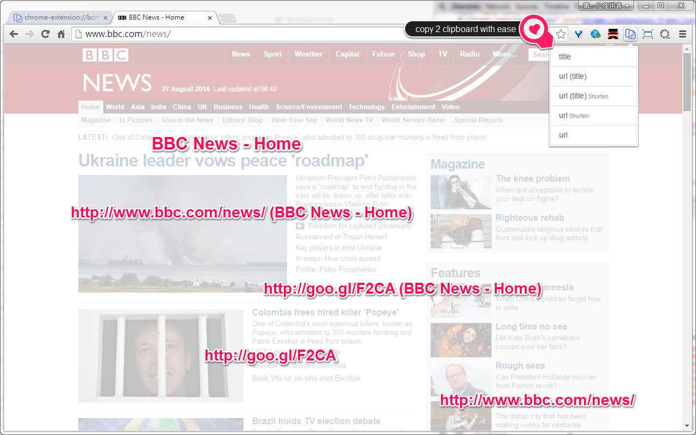
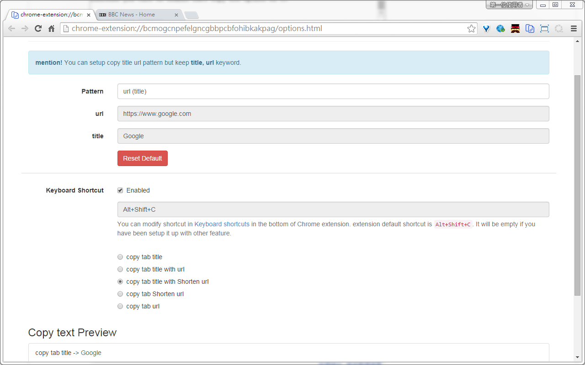

#copy 2 clipboard with ease

a simple way to copy title and url with ease in chrome browser

##features

There have four options:

- copy title only
- copy title and url 
- copy title and shorten url
- copy ulr only
- copy shorten url only
 
Copy title url pattern:

the default copy patter is "url (title)", you can change whatever you want but keep "url" and "title" keyword.

##Change log
===========
0.0.109
chrome shortcut support. Default extension is "Shift+Alt+C". You can setup shortcut you want to enable fast copy one option of 5.

0.0.104 
contextMenus support.

##Snapshot

copy 2 clipboard with ease browser action

copy 2 clipboard with ease copy pattern option

##Chrome web store 
[copy 2 clipboard with ease](https://chrome.google.com/webstore/detail/copy-2-clipboad-with-ease/hiiobhaaokpmdmkkcaokdlanlemmcoah?utm_source=chrome-app-launcher "Google's Homepage")